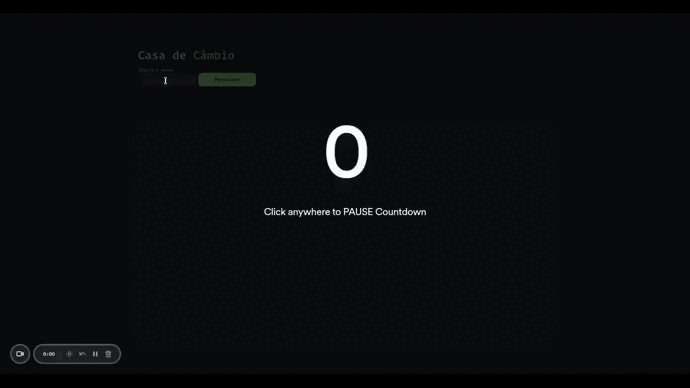

# 🪙 Exchange Office

  

## 📝 About this Project

The exchange house project is an application that seeks to convert the rate of one currency to several others.

> Deploy: https://casa-de-cambio-six.vercel.app/

## 🌐 Required Skills:

> Create semantic tags in HTML

> Use of APIs

## 🛜 Installing the repository on your machine

```js
git@github.com:douglasbacelar/casa-de-cambio.gitt
npm install
```

## 🔧 Tools and Methodologies Used

> HTML5 Semântico

> CSS

> JavaScript


## 💻 Author

Desenvolvido por [Douglas Bacelar](https://www.linkedin.com/in/douglas-bacelar-82b722149)
